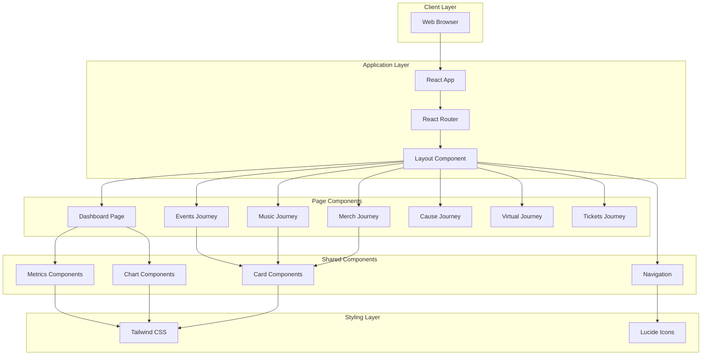
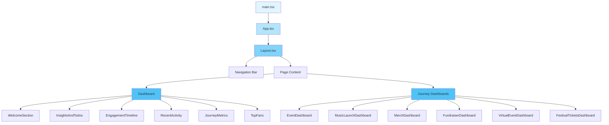
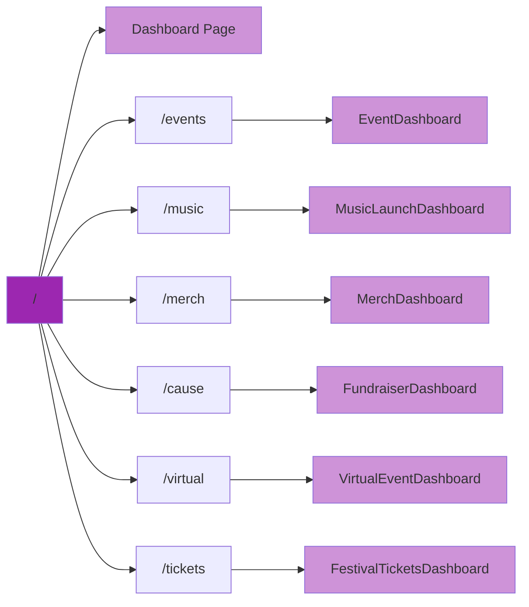
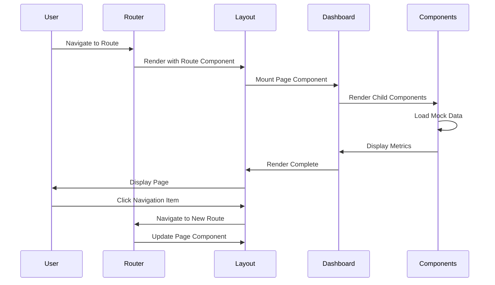

# MINY Dashboard

A modern React-based dashboard application for artists and creators to track and manage engagement with their MINYON holders (fan token holders). Monitor various fan engagement campaigns including events, music releases, merchandise drops, fundraisers, and virtual experiences.

[](https://stackblitz.com/~/github.com/myblackbeanca/minyon)

## Features

- **Dashboard Overview**: Comprehensive view of all engagement metrics and recent activity
- **Journey Management**: Track different types of fan engagement campaigns:
  - 🎤 **Events**: Physical events with RSVPs, location tracking, and song requests
  - 🎵 **Music Teasers**: Unreleased music engagement and feedback
  - 👕 **Merch Access**: Exclusive merchandise offerings and sales tracking
  - ❤️ **Cause Support**: Fundraising campaigns and donation tracking
  - 🎥 **Virtual Events**: Digital meet & greets and online experiences
  - 🎫 **Festival Tickets**: Special-priced festival ticket offerings
- **Top Fans Analytics**: Track and engage with your most active MINYON holders
- **Engagement Timeline**: Visualize engagement trends over time
- **Responsive Design**: Optimized for desktop and mobile devices
- **SEO Optimized**: Dynamic meta tags for improved search visibility

## Tech Stack

- **Frontend Framework**: React 18.3
- **Language**: TypeScript 5.5
- **Build Tool**: Vite 5.4
- **Routing**: React Router DOM v6
- **Styling**: Tailwind CSS 3.4
- **Icons**: Lucide React
- **SEO**: React Helmet Async
- **Linting**: ESLint with TypeScript & React Hooks plugins

## System Architecture

### High-Level Architecture



### Component Hierarchy



### Routing Structure



### Data Flow



## Project Structure

```
minyon/
├── src/
│   ├── components/
│   │   ├── journeys/              # Journey-specific dashboards
│   │   │   ├── EventDashboard.tsx
│   │   │   ├── MusicLaunchDashboard.tsx
│   │   │   ├── MerchDashboard.tsx
│   │   │   ├── FundraiserDashboard.tsx
│   │   │   ├── VirtualEventDashboard.tsx
│   │   │   ├── FestivalTicketsDashboard.tsx
│   │   │   └── index.ts
│   │   ├── dashboard/             # Dashboard-specific components
│   │   ├── hero/                  # Hero section components
│   │   ├── Layout.tsx             # Main layout with navigation
│   │   ├── Dashboard.tsx          # Main dashboard page
│   │   └── [other components]
│   ├── App.tsx                    # Router and route definitions
│   ├── main.tsx                   # Application entry point
│   └── index.css                  # Global styles
├── public/                        # Static assets
├── index.html                     # HTML entry point
├── vite.config.ts                 # Vite configuration
├── tailwind.config.js             # Tailwind CSS configuration
├── tsconfig.json                  # TypeScript configuration
├── eslint.config.js               # ESLint configuration
└── package.json                   # Dependencies and scripts
```

## Setup

### Prerequisites

- Node.js (v16 or higher)
- npm (v7 or higher) or yarn

### Installation

1. **Clone the repository**

   ```bash
   git clone https://github.com/blackbeanca/minyon.git
   cd minyon
   ```

2. **Install dependencies**

   ```bash
   npm install
   ```

   or with yarn:

   ```bash
   yarn install
   ```

3. **Start the development server**

   ```bash
   npm run dev
   ```

   The application will be available at `http://localhost:5173`

### Development Commands

```bash
# Start development server with hot reload
npm run dev

# Build for production
npm run build

# Preview production build locally
npm run preview

# Run ESLint to check code quality
npm run lint
```

### Environment Setup

Currently, the application uses mock/static data. No environment variables are required for local development.

For future API integration, create a `.env` file in the root directory:

```env
VITE_API_URL=your_api_url_here
VITE_API_KEY=your_api_key_here
```

## Development Workflow

### Running Tests

Currently, no testing framework is configured. To add tests:

```bash
npm install -D vitest @testing-library/react @testing-library/jest-dom
```

### Building for Production

```bash
# Create optimized production build
npm run build

# Output will be in the dist/ directory
```

### Deployment

The built application can be deployed to any static hosting service:

- **Vercel**: `vercel --prod`
- **Netlify**: Deploy the `dist` folder
- **GitHub Pages**: Use `gh-pages` package
- **AWS S3**: Upload `dist` folder to S3 bucket

## Browser Support

- Chrome (latest)
- Firefox (latest)
- Safari (latest)
- Edge (latest)

## Contributing

1. Fork the repository
2. Create your feature branch (`git checkout -b feature/amazing-feature`)
3. Commit your changes (`git commit -m 'Add some amazing feature'`)
4. Push to the branch (`git push origin feature/amazing-feature`)
5. Open a Pull Request

## Code Style

This project uses ESLint and TypeScript for code quality. Please ensure your code passes linting before submitting:

```bash
npm run lint
```

## Key Technologies & Libraries

| Technology | Purpose |
|------------|---------|
| React 18 | UI framework with concurrent features |
| TypeScript | Type safety and developer experience |
| Vite | Fast build tool and dev server |
| React Router | Client-side routing |
| Tailwind CSS | Utility-first CSS framework |
| Lucide React | Modern icon library |
| React Helmet Async | Dynamic document head management |

## Future Enhancements

- [ ] API integration for real-time data
- [ ] User authentication and authorization
- [ ] Real-time notifications
- [ ] Data export functionality
- [ ] Advanced analytics and reporting
- [ ] Dark mode support
- [ ] Multi-language support
- [ ] Testing suite (unit, integration, e2e)

## License

Private project - All rights reserved

## Support

For support, please contact the development team or open an issue in the repository.

---

Built with ❤️ for artists and their fans
